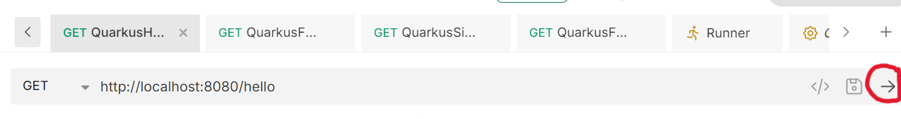
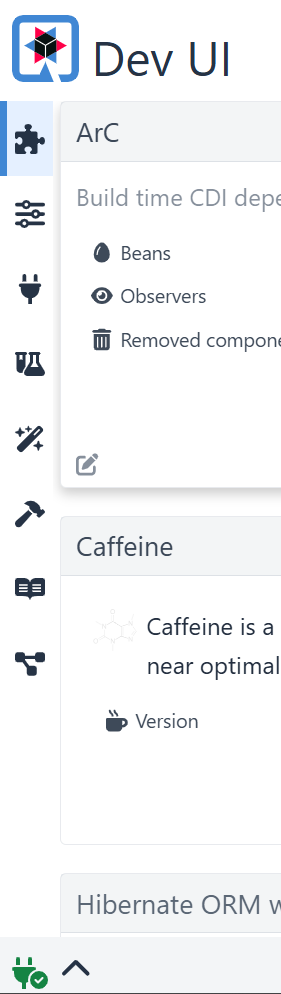
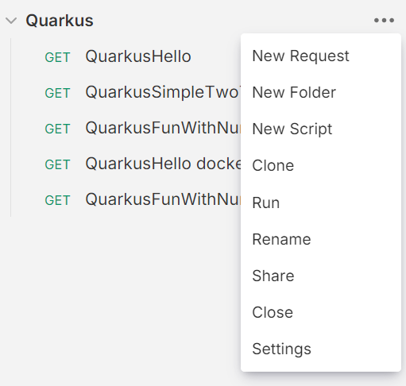
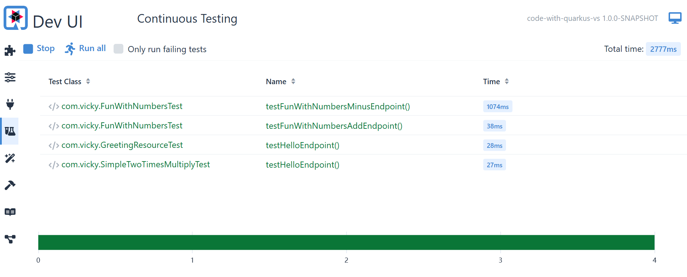

# code-with-quarkus-vs

This project uses Quarkus, the Supersonic Subatomic Java Framework.  Lab created by vicky.stacey@lloydsbanking.com

If you want to learn more about Quarkus, please visit: <https://quarkus.io/>.

# How to use this Lab:
This is a beginners lab to understand the fundamentals of Quarkus.  

## Spring vs Quarkus
If you are using Spring Boot it is important to know there are reasons for choosing one over the other.  You don't need to replace Spring with Quarkus.

Spring Boot is a mature, well-established framework known for its ease of use, extensive ecosystem, and broad support for enterprise-level applications. Quarkus, on the other hand, is a newer framework designed for cloud-native and serverless applications, offering faster startup times, reduced memory footprint, and native compilation. 

# About this Lab
These steps are designed to build up your knowledge with a simple implementation of an api end point and using the dev mode to test.  
We are building out new labs to include objects and databases so please look out for these.

You will run the Quarkus code and use Bruno to test the api as well as experimenting with Test Driven Development (TDD).
If you are an experienced developer this should be easy to use but we also expect this to help beginners.

To get the most from this lab.  Follow the steps below and then experiment.  Find your preferred way of working.

## Don't know what Bruno is?

Bruno is the bank's chosen tool for api testing https://www.usebruno.com/ . It is a way to query your code and test.

# Get started
When you code with Quarkus and save a file you can trigger the tests that use that code to run.  The tests don't run for the code that has not changed.  It also re-compiles.

### 1. For this lab you should use the config given. In IntelliJ Edit configurations to set dev mode.

In your ide run configurations use: `compile quarkus:dev`

### 2. Once the application has started up you will see the Quarkus banner, click into the Terminal and type r. 
  This will trigger Quarkus to run the tests after each save of the code.  If you look in the terminal you will see it says "Profile dev activated. Live Coding activated"

### 3. We have provided you the Bruno tests.  Open Bruno and open the test folder - Collection - Open Collection - navigate to the  "code-with-quarkus-vs\src\bruno\Quarkus"
You are set up with a simple Hello World type api and a double value function.  Run Bruno query "QuarkusHello".

This runs the query against the api

### 4. Now let's break a test: Change the text.  Navigate to line 14 in GreetingResource file . `return "Hello Quarkus VS";`  Change the text. Click ctrl S (or equivalent to save). You will see in the terminal window that the tests re-run.
You will see a message saying:
   Response body doesn't match expectation.
   Expected: is "Hello Quarkus VS"
   Actual: 'your_message'

### 5. Now the test has failed, you can see it in the Quarkus built in dashboard, Dev UI, which is available in dev mode only at <http://localhost:8080/q/dev/>.
   

Navigate to this url and explore the menu on the left: Extensions, Configuration, Endpoints, Continous Testing, Dev Services, Read Me, Dependencies

### 6. . Try changing another file to add some comments and save it e.g. //This is a comment and see what tests run

### 7. In Bruno run all of the tests

### 8. In the FunWithNumbersTest class there is a new endpoint "@Path("/soLong"), think about what value you want to return 
e.g. change "and thanks for all the fish" Save and the tests should re-run and fail.
### 9. Now add some code to FunWithNumbers to return your value.
Try the Quarkus dashboard again to run the tests

Why Quarkus?
It is container first.  K8 Native.
It has many libraries.
It is open source.
Live reload.
